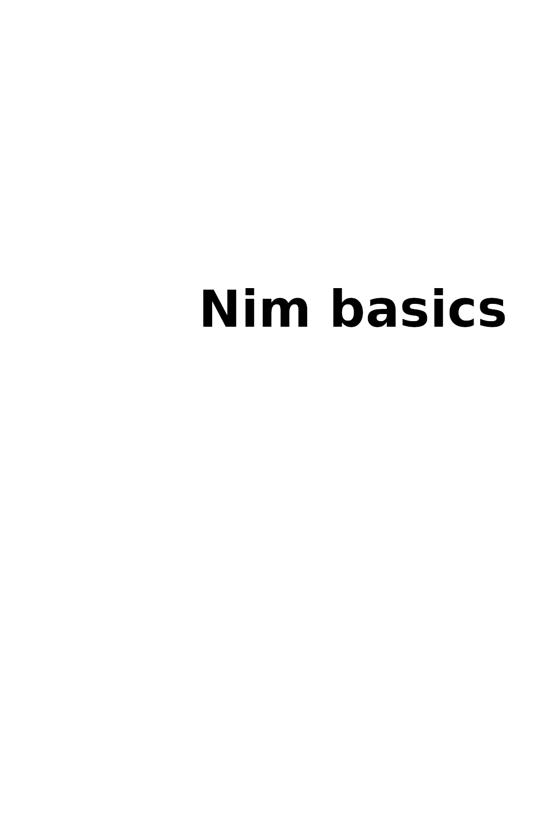

= Nim basics 中文文档
:source-highlighter: rouge
:rouge-style: gruvbox
:source-language: nim
:source-dir: code
:pdf-themesdir: styles
:pdf-theme: pdf
:pdf-folio-placement: physical
:front-cover-image: 
:icons: font
:stylesheet: styles/style.css
:linkcss:
:doctype: book
:toc: left
:description: 本教程旨在向你介绍编程基础及Nim语法，以便你能更轻松地跟进其他教程和/或自行深入探索。Nim是一门相对较新的编程语言，它能让开发者编写出既易读又高性能的代码。
:keywords: nim, nim-basics, Nim basics中文文档

https://nim-lang.org/[Nim] is a relatively new programming language which allows users to write easy-to-read high-performance code.
But if you are reading this Nim tutorial, the chances are that you already know about Nim.

The tutorial is available both https://narimiran.github.io/nim-basics/[online] and as a https://github.com/narimiran/nim-basics/raw/master/nim-basics.epub[book in epub format].

This is a work-in-progress: if you spot any errors and/or you have an idea how to make this tutorial better, please report it to the https://github.com/narimiran/nim-basics/issues[issue tracker].

https://nim-lang.org/[Nim] 是一门相对较新的编程语言，它能让用户编写出既易于阅读又高性能的代码。但如果你正在阅读这篇Nim教程，很可能你已经对 Nim 有所了解。
本教程提供在线阅读和 epub 格式的电子书版本。

这是一项进行中的工作：如果您发现任何错误，或者有改进本教程的建议，请到 https://github.com/narimiran/nim-basics/issues[issue tracker] 报告。

== 本教程适合谁
* 没有或仅有少量编程经验的人士
* 有其他编程语言基础的人士
* 想要从零开始首次探索 Nim 语言的人们

== 这不适合谁？
* 拥有丰富编程经验的人士：其他更高级的教程可能更适合您。可参阅 https://nim-lang.org/docs/tut1.html[Official Tutorial] 或 https://nim-by-example.github.io/[Nim by Example]。
* 已掌握 Nim 语言的人士（欢迎协助完善本教程）

== 如何使用本教程？
本教程旨在向你介绍编程基础及Nim语法，以便你能更轻松地跟进其他教程和/或自行深入探索。

与其仅阅读文本内容，最佳方式是亲自尝试、修改示例、构思自己的例子并保持好奇心。某些章节末尾的练习不容忽视——切勿跳过。

若需进一步理解教程内容或完成练习，你随时可在 https://forum.nim-lang.org/[Nim 论坛]、 https://gitter.im/nim-lang/Nim[Nim Gitter 频道] , https://discordapp.com/invite/ezDFDw2[Discord server] 、或  Nim's IRC channel on freenode #nim 寻求帮助。

== 译者注
本文档归属于 https://github.com/sakuraflows/nim-basics-chs[nim-basics-chs]项目，文档的所有内容默认均为机翻，如有勘误及补充，欢迎在 https://github.com/sakuraflows/nim-basics-chs/issues[issues] 提出！

在线浏览： https://sakuraflows.github.io/nim-basics-chs/[Nim basics 中文文档] 

nim是一门正在快速迭代的新兴程序语言，因此本文档中的内容不免存在过时情况，请根据自己的实际情况按需阅读和学习。

include::01-installation.adoc[]

include::02-variables.adoc[]

include::03-types.adoc[]

include::04-control-flow.adoc[]

include::05-loops.adoc[]

include::06-containers.adoc[]

include::07-procedures.adoc[]

include::08-modules.adoc[]

include::09-user-input.adoc[]

include::10-conclusion.adoc[]

{nbsp}

{nbsp}

'''

{nbsp}

The source files are available https://github.com/narimiran/nim-basics[on Github].
